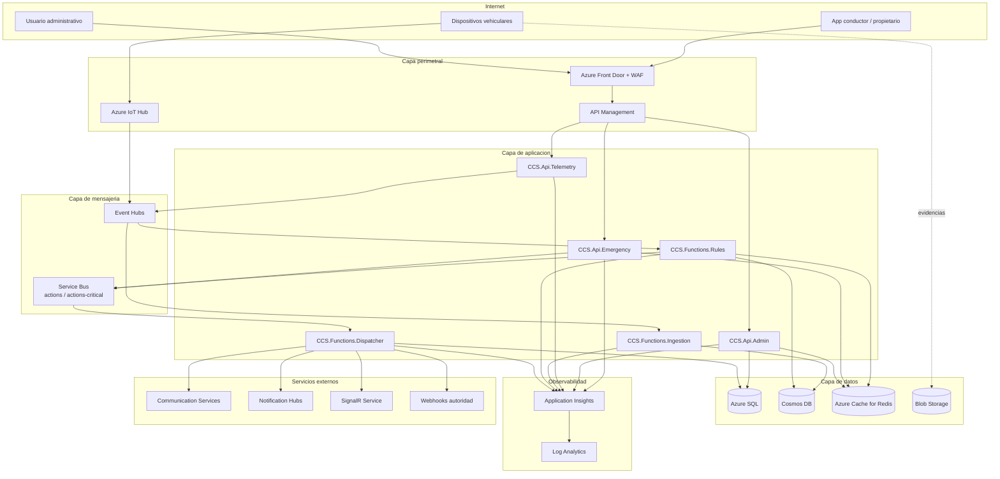

# Diagrama de despliegue

Este despliegue es la propuesta objetivo en Azure. Para la prueba tecnica no se ejecuta ningun despliegue; los archivos Bicep en `infra/` quedan como artefacto revisable.

## Vista de despliegue

## Ambientes

Los parametros Bicep estan separados por ambiente:

- `infra/params/dev.bicepparam`
- `infra/params/stg.bicepparam`
- `infra/params/prod.bicepparam`

La separacion permite ajustar capacidad, SKU, retencion y politicas por ambiente sin cambiar los modulos base.

## Relacion con el repositorio local

- Las APIs locales usan almacenamiento en memoria para validar contratos y flujos.
- Las Functions estan representadas como proyectos .NET testeables.
- `scripts/deploy-infra.sh` solo imprime comandos de referencia; no ejecuta `az deployment`.
