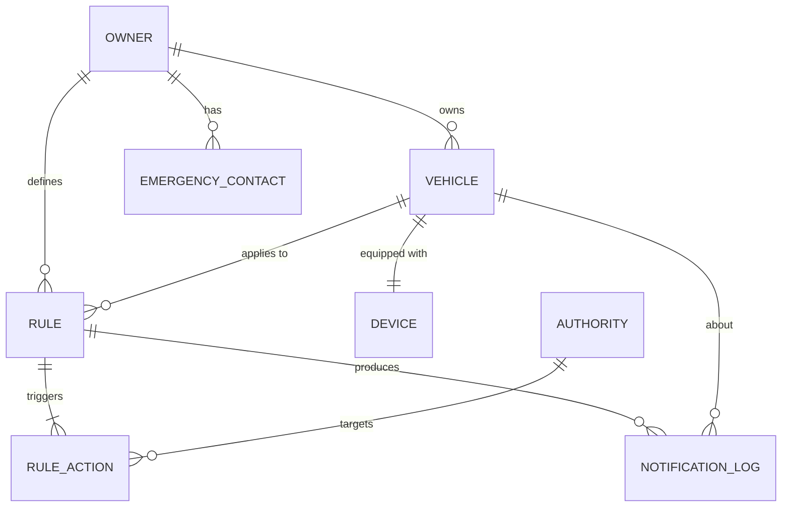

# Modelo Entidad Relacion

## Separacion de Datos

| Motor | Responsabilidad |
|---|---|
| Azure SQL | Propietarios, vehiculos, dispositivos, reglas, acciones, contactos, autoridades, auditoria y notificaciones. |
| Cosmos DB | Telemetria cruda, eventos operativos y estado actual por vehiculo/dispositivo. |
| Redis | Reglas activas por `deviceId` y datos calientes del camino critico. |
| Blob Storage | Snapshots, evidencias y referencias a video. |

## Entidades SQL

- `Owner`: propietario del vehiculo.
- `Vehicle`: vehiculo afiliado.
- `Device`: sensor fisico instalado.
- `Rule`: regla definida por propietario.
- `RuleAction`: accion asociada a una regla.
- `EmergencyContact`: contactos de emergencia.
- `Authority`: autoridades y organismos de socorro.
- `AuditLog`: auditoria de cambios.
- `NotificationLog`: registro de notificaciones enviadas.

## Artefacto de Diagramacion
El modelo ER oficial para diagramacion esta en formato DBML:

```text
database/model/ccs-er-model.dbml
```

Este archivo esta preparado para copiarse directamente en https://dbdiagram.io/.

Tambien existe una version auxiliar Mermaid en `docs/diagrams/er-model.mmd`, pero el artefacto principal del entregable es el DBML.

## Diagrama ER



## Escalabilidad de Base de Datos
- SQL usa indices sobre `OwnerId`, `VehicleId`, `EventType`, `CorrelationId` y fechas operativas.
- `AuditLog` y `NotificationLog` se particionan por mes.
- Cosmos usa partition key `/deviceId`, TTL e indexing policies optimizadas.
- Redis evita consultas SQL en el camino critico de emergencia.
