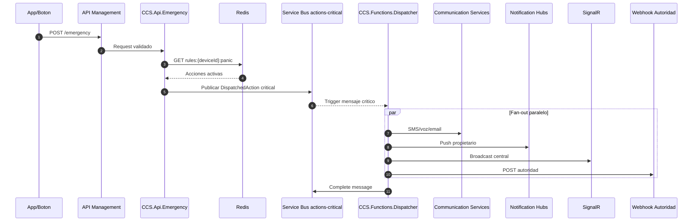
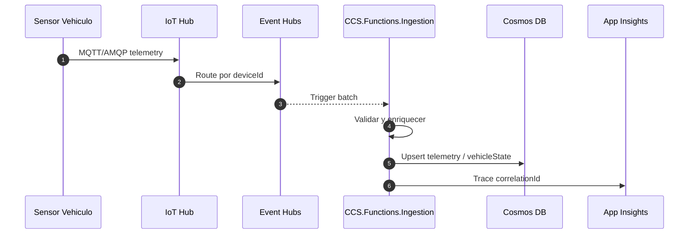
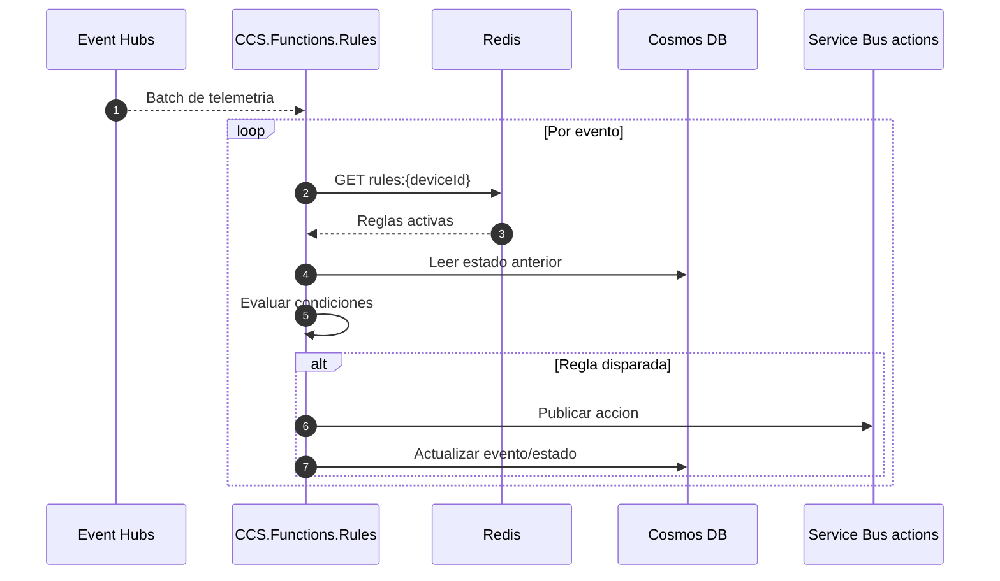
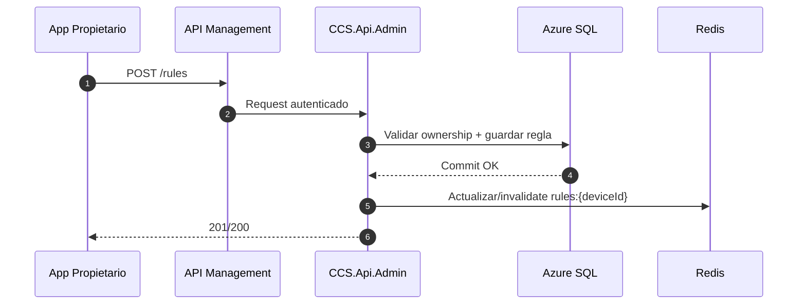

# Diagramas de Secuencia

## Emergencia / Boton de Panico

```mermaid
sequenceDiagram
  autonumber
  participant U as App/Boton
  participant APIM as API Management
  participant E as CCS.Api.Emergency
  participant R as Redis
  participant SB as Service Bus actions-critical
  participant D as CCS.Functions.Dispatcher
  participant ACS as Communication Services
  participant NH as Notification Hubs
  participant SR as SignalR
  participant WH as Webhook Autoridad

  U->>APIM: POST /emergency
  APIM->>E: Request validado
  E->>R: GET rules:{deviceId}:panic
  R-->>E: Acciones activas
  E->>SB: Publicar DispatchedAction critical
  SB-->>D: Trigger mensaje critico
  par Fan-out paralelo
    D->>ACS: SMS/voz/email
    D->>NH: Push propietario
    D->>SR: Broadcast central
    D->>WH: POST autoridad
  end
  D->>SB: Complete message
```

## Ingesta de Telemetria

```mermaid
sequenceDiagram
  autonumber
  participant S as Sensor Vehiculo
  participant IoT as IoT Hub
  participant EH as Event Hubs
  participant I as CCS.Functions.Ingestion
  participant C as Cosmos DB
  participant AI as App Insights

  S->>IoT: MQTT/AMQP telemetry
  IoT->>EH: Route por deviceId
  EH-->>I: Trigger batch
  I->>I: Validar y enriquecer
  I->>C: Upsert telemetry / vehicleState
  I->>AI: Trace correlationId
```

## Evaluacion de Reglas

```mermaid
sequenceDiagram
  autonumber
  participant EH as Event Hubs
  participant RE as CCS.Functions.Rules
  participant R as Redis
  participant C as Cosmos DB
  participant SB as Service Bus actions

  EH-->>RE: Batch de telemetria
  loop Por evento
    RE->>R: GET rules:{deviceId}
    R-->>RE: Reglas activas
    RE->>C: Leer estado anterior
    RE->>RE: Evaluar condiciones
    alt Regla disparada
      RE->>SB: Publicar accion
      RE->>C: Actualizar evento/estado
    end
  end
```

## Administracion de Reglas

```mermaid
sequenceDiagram
  autonumber
  participant U as App Propietario
  participant APIM as API Management
  participant A as CCS.Api.Admin
  participant SQL as Azure SQL
  participant R as Redis

  U->>APIM: POST /rules
  APIM->>A: Request autenticado
  A->>SQL: Validar ownership + guardar regla
  SQL-->>A: Commit OK
  A->>R: Actualizar/invalidate rules:{deviceId}
  A-->>U: 201/200
```
